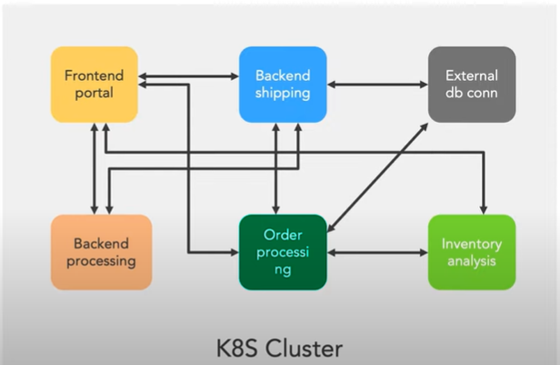

# Istio

**Istio's Purpose:** Istio is a service mesh technology, providing management of service-to-service communications for microservices in a Kubernetes cluster. It handles routing, load balancing, service discovery, security (TLS encryption), and monitoring, among other tasks.

**Service Mesh:** A service mesh abstracts away the complexity of microservice communications, enabling services to communicate without the application itself handling those connections. Instead of embedding communication logic in each microservice, it's moved outside to a separate layer. This becomes crucial as applications scale, with more services and more complex communication patterns.

**based on aboce chat**
Managing traffic and communication between services in Kubernetes can become complex, especially when dealing with multiple microservices like a frontend application, backend processing, order management, inventory analysis, and a database microservice. For instance, the frontend needs to communicate with shipping, order processing, and backend services, while these backend services also need to communicate with the database. Manually managing this communication, even with just five or six microservices, can be challenging.

As the number of microservices grows to 100 or more, the complexity increases significantly. Ensuring reliable communication, handling service discovery, and maintaining TLS encryption for secure communication between services becomes a major concern. Without a service mesh like Istio, managing this level of inter-service communication manually is not scalable and introduces several operational challenges.

**what about routing and discovery** When a new microservice is added to the architecture, it often requires communication with existing microservices, and vice versa. This introduces additional complexity as we need to ensure seamless communication between the new and old services. Each microservice might have dependencies on other services for data or functionality, and as the number of microservices grows, managing these communication paths becomes increasingly difficult.

Without proper tools or automation, handling service discovery, routing, and ensuring secure communication (like using TLS) between services manually becomes highly challenging. As the system scales with more microservices, this complexity can grow exponentially, making it harder to maintain and manage the architecture effectively.
