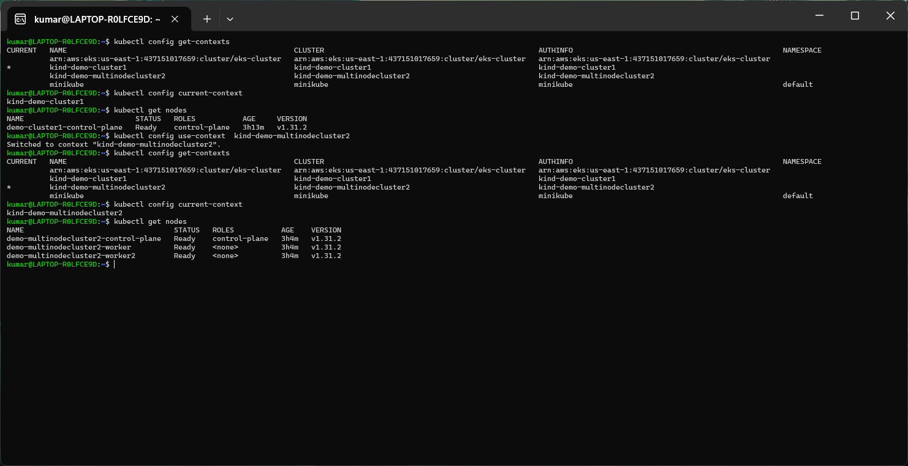

# Setting Up Kubernetes with Kind

This guide walks you through setting up a Kubernetes cluster locally using Kind (Kubernetes in Docker).

## Prerequisites

Before you begin, ensure you have:
- [Docker](https://docs.docker.com/get-docker/) installed
- [Go](https://golang.org/doc/install) installed

## Installation

### Installing Kind on Ubuntu

Choose the appropriate command based on your architecture:

```bash
# For AMD64 / x86_64
[ $(uname -m) = x86_64 ] && curl -Lo ./kind https://kind.sigs.k8s.io/dl/v0.26.0/kind-linux-amd64

# For ARM64
[ $(uname -m) = aarch64 ] && curl -Lo ./kind https://kind.sigs.k8s.io/dl/v0.26.0/kind-linux-arm64

# Make the binary executable and move it to PATH
chmod +x ./kind
sudo mv ./kind /usr/local/bin/kind
```

## Creating Clusters

### Single-Node Cluster

Create a basic cluster with just a control plane:

```bash
kind create cluster \
  --image kindest/node:v1.31.4@sha256:2cb39f7295fe7eafee0842b1052a599a4fb0f8bcf3f83d96c7f4864c357c6c30 \
  --name demo-cluster1
```

### Multi-Node Cluster

1. Create a configuration file named `kind-config.yaml`:

```yaml
kind: Cluster
apiVersion: kind.x-k8s.io/v1alpha4
nodes:
- role: control-plane
- role: worker
- role: worker
```

2. Create the cluster using the config:

```bash
kind create cluster \
  --image kindest/node:v1.31.4@sha256:2cb39f7295fe7eafee0842b1052a599a4fb0f8bcf3f83d96c7f4864c357c6c30 \
  --name demo-multinode-cluster2 \
  --config kind-config.yaml
```

## Verification

Verify your cluster setup:

```bash
# Check cluster information
kubectl cluster-info

# View nodes
kubectl get nodes
```

# Kubernetes Context Management Commands

Quick reference guide for managing Kubernetes contexts.

## View Contexts

```bash
# List all available contexts
kubectl config get-contexts

# Show current context
kubectl config current-context
```

## Switch Contexts

```bash
# Switch to a different context
kubectl config use-context <context-name>

# Example:
kubectl config use-context kind-demo-multinodecluster2
```

## Available Contexts

Currently configured contexts:
- `arn:aws:eks:us-east-1:437151017659:cluster/eks-cluster` (EKS)
- `kind-demo-cluster1` (Kind single-node)
- `kind-demo-multinodecluster2` (Kind multi-node)
- `minikube` (Minikube)



